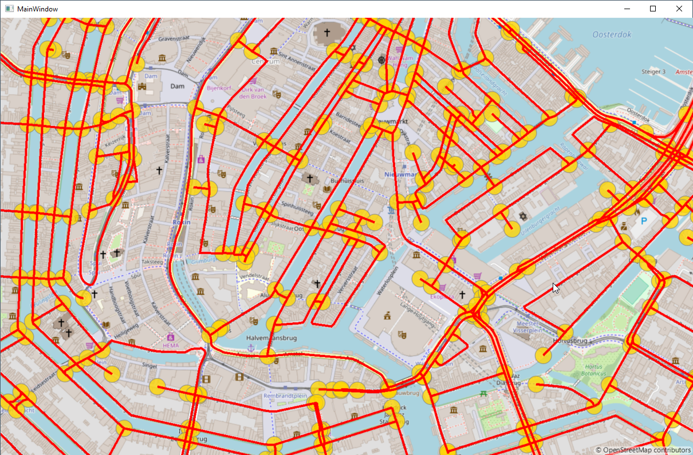

# sharedstreets-vector-tile

[](https://www.nuget.org/packages/Bertt.SharedStreets.Vector.Tile/)

.NET Standard 2.0 library for reading/writing SharedStreets tiles.

SharedStreets demo viewer: https://platform.sharedstreets.io/52.37568/4.9058/14.115/

## Sample vector tiles

Sample amsterdam:

- Geometry: https://tiles.sharedstreets.io/osm/planet-181224/12-2103-1346.geometry.6.pbf
- Intersection: https://tiles.sharedstreets.io/osm/planet-181224/12-2103-1346.intersection.6.pbf
- Metadata: https://tiles.sharedstreets.io/osm/planet-181224/12-2103-1346.metadata.6.pbf
- Reference: https://tiles.sharedstreets.io/osm/planet-181224/12-2103-1346.reference.6.pbf

screenshot sample app (https://github.com/bertt/sharedstreets.vector.tile/tree/master/samples/WpfSample):



## Sample code

```
var amsterdamTile = "./testfixtures/12-2103-1346.";
var geometryStream = File.OpenRead(amsterdamTile + "geometry.6.pbf");
var intersectionStream = File.OpenRead(amsterdamTile + "intersection.6.pbf");
var metadataStream = File.OpenRead(amsterdamTile + "metadata.6.pbf");
var referenceStream = File.OpenRead(amsterdamTile + "reference.6.pbf");

// reading
var geometries = SharedStreetsParser.Parse<SharedStreetsGeometry>(geometryStream);
Assert.IsTrue(geometries.Count == 6202);
var intersections = SharedStreetsParser.Parse<SharedStreetsIntersection>(intersectionStream);
Assert.IsTrue(intersections.Count == 4031);
var metadata = SharedStreetsParser.Parse<SharedStreetsMetadata>(metadataStream);
Assert.IsTrue(metadata.Count == 6202);
var references = SharedStreetsParser.Parse<SharedStreetsReference>(referenceStream);
Assert.IsTrue(references.Count == 8691);

// writing
var streamGeometries = SharedStreetsTileWriter.Write(geometries);
var streamIntersection = SharedStreetsTileWriter.Write(intersections);
var streamMetadata = SharedStreetsTileWriter.Write(metadata);
var referenceMetadata = SharedStreetsTileWriter.Write(reference);
```

## Datamodel

Geometry: [Id, FromIntersectionId, ToIntersectionId, BackReferenceId, ForwardReferenceId, LonLats, RoadClass]

Intersection: [Id, Lon, Lat, NodeId, InboundReferenceIds, OutboundReferenceIds]

Metadata: [GeometryId, GisMetadata, OsmMetadata]

Reference: [Id, GeometryId, LocationReferences, FormOfWay]

LocationReference: [IntersectionId, lon, lat, InboundBearing, OutboundBearing, DistanceToNextRef] (nb: distance is in cm)

FormOfWay: [Undefined = 0, Motorway = 1, MultipleCarriageway = 2, SingleCarriageway = 3, Roundabout = 4, TrafficSquare = 5, SlipRoad = 6, Other = 7]

RoadClass:  [Motorway = 0, Trunk = 1, Primary = 2, Secondary = 3, Tertiary = 4, Residential = 5, Unclassified = 6, Service = 7, Other = 8]

## Protocol buffer generated code

The file 'SharedStreetsProto.cs' is generated by tool 'protoc' based on the 'sharedstreets.proto' definition file.

- sharedstreets.proto file is copied from : https://github.com/sharedstreets/sharedstreets-ref-system/blob/master/proto/sharedstreets.proto

- tool protoc can be obtained from https://github.com/protocolbuffers/protobuf/releases

- Compile command (generates a c# file):

```
$ protoc sharedstreets.proto --csharp_out=.
```


## Api samples

1] Get by id

Request: HTTP GET https://api.sharedstreets.io/v0.1.0/id/7f1e47e658e554625c51c6fc6cdafcda

Response: 
```
{"type":"INT","tiles":["osm/planet-180430/12-2103-1346.intersection.6.pbf","osm/planet-180730/12-2103-1346.intersection.6.pbf","osm/planet-181126/12-2103-1346.intersection.7.pbf","osm/planet-181029/12-2103-1346.intersection.6.pbf","osm/planet-181029/12-2103-1346.intersection.7.pbf","osm/planet-181029/12-2103-1346.intersection.8.pbf","osm/planet-180625/12-2103-1346.intersection.6.pbf","osm/planet-180528/12-2103-1346.intersection.6.pbf","osm/planet-180528/12-2103-1346.intersection.7.pbf","osm/planet-180827/12-2103-1346.intersection.6.pbf","osm/planet-180827/12-2103-1346.intersection.7.pbf","osm/planet-180924/12-2103-1346.intersection.6.pbf","osm/planet-180924/12-2103-1346.intersection.7.pbf","osm/planet-181126/12-2103-1346.intersection.6.pbf"]}
```

2] Get by bbox

Request: HTTP GET https://api.sharedstreets.io/v0.1.0//geom/within?bounds=5.140647,52.082269,5.156558,52.088242&auth=<auth_key>

Response: GeoJSON

3] Match line

Request: HTTP POST https://api.sharedstreets.io/v0.1.0/match/geoms?&includeStreetnames=true&lengthTolerance=0.1&bearingTolerance=10&searchRadius=15&auth=<auth_key>5&ignoreDirection=true&snapToIntersections=true

body:

```
{"type":"Feature","geometry":{"type":"LineString","coordinates":[[-122.33482897844316,47.60832634703897],[-122.33395994272226,47.60869886212237]]},"properties":{}}
```

Response:
```
{"matched":{"type":"FeatureCollection","features":[{"type":"Feature","properties":{"referenceId":"b60d4a26865ad09424a4879130600bf2","fromIntersectionId":"e9604c0d8549130e5de39c96565d07b7","toIntersectionId":"39b03988800c0804ed8a4f68c414a854","fromStreetnames":["4th Avenue"],"toStreetnames":["5th Avenue"],"roadClass":"Tertiary","direction":"forward","geometryId":"c9ed74564c19b8b1690edd9d3fa009cf","streetname":"University Street","referenceLength":99.77,"section":[0,99.77],"side":"left","originalFeature":{"type":"Feature","geometry":{"type":"LineString","coordinates":[[-122.33482897844316,47.60832634703897],[-122.33395994272226,47.60869886212237]]},"properties":{}}},"geometry":{"type":"LineString","coordinates":[[-122.3348881,47.6082149],[-122.3347427,47.6082751],[-122.3343875,47.6084223],[-122.33422060000001,47.608491400000005],[-122.3338736,47.6086351],[-122.3337566,47.608683600000006]]}}]},"unmatched":{"type":"FeatureCollection","features":[]},"invalid":{"type":"FeatureCollection","features":[]}}
```

3] Match by point

Request: HTTP GET https://api.sharedstreets.io/v0.1.0/match/point/5.1425551,52.0672745?auth=<auth_key>&searchRadius=50&maxCandidates=5

Response:

```
{"type":"FeatureCollection","features":[{"type":"Feature","properties":{"score":32.16877069240368,"location":66.45074689002726,"referenceLength":136.78,"geometryId":"389541a40a8974cb71de9f846b44ae93","referenceId":"638a9b34ec222058cc371bf469b63c82","direction":"forward","bearing":327.7957985073536,"snappedSide":"right","interceptAngle":89.99911590061811},"geometry":{"type":"Point","coordinates":[5.1421568959951385,52.06712031767315]}},{"type":"Feature","properties":{"score":32.16877069240368,"location":70.32925310997274,"referenceLength":136.78,"geometryId":"389541a40a8974cb71de9f846b44ae93","referenceId":"f9c5a4bcd9c487bb9613daa5d2f3d286","direction":"backward","bearing":147.79579850735362,"snappedSide":"left","interceptAngle":269.99911590061805},"geometry":{"type":"Point","coordinates":[5.1421568959951385,52.06712031767315]}}]}
```

